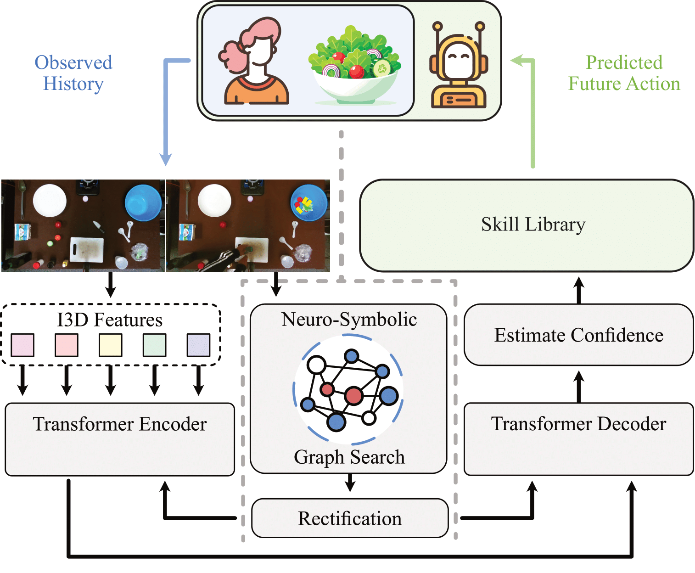

# Let Me Help You! Neuro-Symbolic Short-Context Action Anticipation

This is a PyTorch implementation of the paper "<i>Let Me Help You!</i> Neuro-Symbolic Short-Context Action Anticipation". This work has been accepted to the [IEEE Robotics and Automation Letters (RA-L)](https://www.ieee-ras.org/publications/ra-l), 2024.

|📑 Original Paper|📰 Project Page
|:-:|:-:|:-:|:-:|
[Paper](https://ieeexplore.ieee.org/document/10582423) | [Project Page](https://sarthak268.github.io/NeSCA/) 



## Abstract

In an era where robots become available to the general public, the applicability of assistive robotics extends across numerous aspects of daily life, including in-home robotics.
This work presents a novel approach for such systems, leveraging long-horizon action anticipation from short-observation contexts.
In an assistive cooking task, we demonstrate that predicting human intention leads to effective collaboration between humans and robots.
Compared to prior approaches, our method halves the required observation time of human behavior before accurate future predictions can be made, thus, allowing for quick and effective task support from short contexts. 
To provide sufficient context in such scenarios, our proposed method analyzes the human user and their interaction with surrounding scene objects by imbuing the system with additional domain knowledge, encoding the scene object's affordances. 
We integrate this knowledge into a transformer-based action anticipation architecture, which alters the attention mechanism between different visual features by either boosting or attenuating the attention between them. 
Through this approach, we achieve an up to 9% improvement on two common action anticipation benchmarks, namely <i>50Salads</i> and <i>Breakfast</i>.
After predicting a sequence of future actions, our system selects an appropriate assistive action that is subsequently executed on a robot for a joint salad preparation task between a human and a robot. 

## Citation 

In case you find our work useful, consider citing:
```
@ARTICLE{BhagatNeSCA,
  author={Bhagat, Sarthak and Li, Samuel and Campbell, Joseph and Xie, Yaqi and Sycara, Katia and Stepputtis, Simon},
  journal={IEEE Robotics and Automation Letters}, 
  title={Let Me Help You! Neuro-Symbolic Short-Context Action Anticipation}, 
  year={2024},
  pages={1-8},
  doi={10.1109/LRA.2024.3421848}}
``` 

## Index

1. [Environment Setup](#setup)
2. [Dataset](#dataset)
3. [Training](#training)
4. [Testing](#testing)
5. [License](#license)

## Setup

This system was tested on Ubuntu 22.04.
In order to build a ```conda``` environment for running our model, run the following command:
```
conda env create -f environment.yml
```

Activate environment using:
```
conda activate nesca
```

## Dataset

We train our action anticipation pipeline on two publicly available datasets namely, <i>50Salads</i> and <i>Breakfast</i> dataset. You can download the features from [this link](https://mega.nz/file/O6wXlSTS#wcEoDT4Ctq5HRq_hV-aWeVF1_JB3cacQBQqOLjCIbc8). 
<br>
To leverage the trained model on our real-world setup, we finetune our model on the collected demonstrations. We also open-source the dataset that we collect in our real-world setup to promote research on action anticipation in complex scenarios. The dataset can be found [here](https://drive.google.com/drive/u/1/folders/1gfhkG3zDmewIR4CnO7KbSB1Kwvu15jl0).  

## Training 

To train our model on the 50Salads dataset, run the following command:
```
CUDA_VISIBLE_DEVICES=GPU_ID python main.py --task long --seg --anticipate --pos_emb --n_query 20 --n_encoder_layer 2 --n_decoder_layer 2 --batch_size 8 --hidden_dim 512 --workers 1 --dataset 50salads --max_pos_len 3100 --sample_rate 6 --epochs 70 --mode=train --input_type=i3d_transcript --split=SPLIT_NUM
```

Most training parameters are similar to the ones in [codebase](https://github.com/gongda0e/FUTR), so please refer to their codebase for more information on the training parameters. 
To train the baseline model without NeSCA (i.e. FUTR), you can turn the arguments `use_gsnn` and `kg_attn` as False in `opts.py`. Alternatively, you can use the weights provided [here](https://github.com/gongda0e/FUTR). 

## Testing

You can find the pre-trained weights for our model trained on the 50Salads dataset [here](https://drive.google.com/drive/folders/1ezfe2V_buwmu21F4DK1xdDVnJaI_dpsp?usp=sharing). <br>
To obtain the results mentioned in the paper, your trained models must be placed in a directory called ```ckpt/``` inside the home directory and then run the following command. 

```
CUDA_VISIBLE_DEVICES=GPU_ID python main.py --hidden_dim 512 --n_encoder_layer 2 --n_decoder_layer 2 --n_query 20 --seg --task long --pos_emb --anticipate --max_pos_len 3100 --sample_rate 6 --dataset 50salads --predict --mode=train --split=SPLIT_NUM
```

## Resources 

This implementation has been greatly inspired by the [codebase](https://github.com/gongda0e/FUTR) for the [FUTR paper](https://arxiv.org/abs/2205.14022).

## License

Copyright (c) 2023 Sarthak Bhagat, Samuel Li, Joseph Campbell, Yaqi Xie, Katia Sycara, Simon Stepputtis

For license information, see the license.
